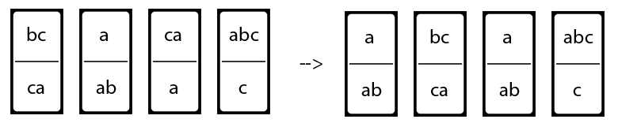

# Challenge 7 (01/05/2020): ☭ The Portuguese Communist Party ☭

## Background

Jerónimo de Sousa and his gang are playing Dominoes in Alameda Dom Afonso
Henriques on this International Worker's Day.

They are growing old and getting pretty tired of the same dull rules of Dominoes
so they decide to give it a twist.

One by one, they grab a piece of domino from an infinite stack of dominoes (yes,
this stack is higher than Torre de Belém). First to win is the one that has the
top part of their dominoes matching the bottom part.

Legend has it that they will be playing this game until the End of Time...

## Specification

Given a (finite) collection of dominoes, each containing two strings, one on top
and another on bottom, the task is is to make a list of these dominoes, with
repetitions allowed, so that the string we get by reading off the symbols on the
top is the same as the string of symbols on the bottom.

Create a function `pcp s`, that returns the string that matches, if such list
exist, otherwise it returns `no`.

See [Example 1](#example-1) for clarity.

`s` is a set of 2-tuples, e.g `{(bc, ca), (a, ab)}`, where the first element is
a string that is the top part of a "domino" and the second element is the bottom
part. The alphabet of the strings is limited to `{a, b, c}`. The strings are not
empty and can have repeated characters.

If such list exists, the matching string should be returned. Otherwise, the
output is `no`.

Any matching string solves the task (or `no` if no solution is possible).

At most, 100 domino pieces should be used for the solution. If no solution is
found with 100 or less pieces, the output should be `no`.

The input set is not empty, it does not have repeated dominoes and it is not
necessary to use all dominoes from input in the solution. An empty solution (e.g
not using any domino) is not allowed.

## Technicalities

For golf purposes, only the definition and declaration of the function `pcp`
count. Input of the `pcp` function should already be "parsed" i.e you do not
need to implement input / output from stdin / to stdout inside `pcp`.

## Examples

### Example 1:

`pcp {(bc, ca), (a, ab), (ca, a), (abc, c)}` -> `abcaabc`

Because the sequence of dominoes where the concatenated top string matches the
bottom string is `(a, ab)`, and then `(bc, ca)`, and then `(a, ab)` again, and
finally `(abc, c)`. Note that repetitions are allowed and the piece `(ca, a)`
was not used.



### Example 2:

`pcp {(abc, ab), (ca, a), (acc, ba)}` -> `no`

No solution is possible. It's not possible to have a list of dominoes where the
top string matches the bottom string.

## Test Cases

`pcp {(bc, ca), (a, ab), (ca, a), (abc, c)}` -> `abcaabc`  
`pcp {(abc, ab), (ca, a), (acc, ba)}` -> `no`  
`pcp {(a, a), (b, b)}` -> `a` or `b` or `aa` or `ab` or ...  
`pcp {(c, ab), (aa, b)}` -> `no`  
`pcp {(ab, aa), (bba, bb), (a, baa)}` -> `bbaabbbaa`  
`pcp {(baa, b), (ba, baa), (ba, aba), (ab, bba)}` -> `baabbaababbabbabaabbaabbaababbaababbabbaababbabbabaabbbabbabaabababbabbababbabbabbabaabbaabbbababbaababbabbaabbbabbabaabbbabbababbabbababbababbaabbbabbaba`  
`pcp {(baa, b), (a, baa), (b, a)}` -> `no`  


## Solutions

### (132) Haskell by André Silva

```haskell
import Control.Monad
import Data.Maybe
import Data.List
pcp x=maybe"no"fst$listToMaybe$catMaybes$map(\n->find(uncurry(==))$map(foldl(\(a,b)(c,d)->(a++c,b++d))("",""))$replicateM n x)[1..100]
```

### (174) JavaScript by Restivo (works for 100 tiles) ([Try it online](https://tio.run/##TY7BboQgFEV/hR28aI3umtDX3@iCsABHK4aIAWYKcfx2i2OadPNyzr15yZ3VQ4XemzW@Pd6PY@1XtPi5BRSC0ppSKfkNW/4zGTuwW1V9dG0HW0Qh@eg8M8SNJMCJ84kWtoRGtLKay@G5cHdyJ7kZWULM4Id49wtJr6AJUfkYvkycWIbnM/8PEkBs1nuYmEh1lsD3gHG//uni6H70bgnODo1136xMZ2W01orWhGoqa1LsEqWK/pnS6iqVfpWnSoDjFw))

```javascript
pcp=l=>{s=[['','']];d=0;while(d++<101){t=[];for(i of s)for(j of l){x=i[0]+j[0];y=i[1]+j[1];if(x==y)return x;if(x.startsWith(y)||y.startsWith(x))t.push([x,y]);}s=t}return'no'}
```

### (225) Python by Duarte (non-deterministic runs 🤪) ([Try it online!](https://tio.run/##bZFNasMwEIX3PsVAFxqlIcS0hWDqk5gsRrJDXIwkZJnSlp7d1Y@VOGk2Rm/mzfdGsvlyZ61eDsbOc9udwEiDI68KCEKjCUc4aQst9ArGoKA/4VTVjO0@dK@w2Xz3Bjeoqto8N@2R82Oz99@6xuGfS/lm6ZuV7dxkFUyJB0OnUPH3cl8CqRan3ejIuvGzd2ccuI8f1pWJ8@CyVa391AVmC8insGNsNz6sG8YOmNJsNrZXDsMdf5AJybbAJDG@BWQUBIkkZFJLZzEy/sujR1Io8eKGtrgeE2TsCVoQfpX76ZVbRG9Ou3fepBCtvQ@wkUUZLJJdrG4sKC/luyRE1MUTJEz4Lfm1RM6KqOvwVZK4vFjKiWhfKd9e@fwH "Python 3.8  – Try It Online"))

```python
def pcp(s):
 def o(p):
  for d in s:
   if(u:=''.join([*zip(*(n:=p+[d]))][0]))==(l:=''.join([*zip(*n)][1])):return u
   if len(n)<101 and(u.startswith(l)or l.startswith(u))and(r:=o(n)):return r
 return r if(r:=o([]))else 'no'

# print(pcp({('bc', 'ca'), ('a', 'ab'), ('ca', 'a'), ('abc', 'c')}), 'abcaabc')
```

